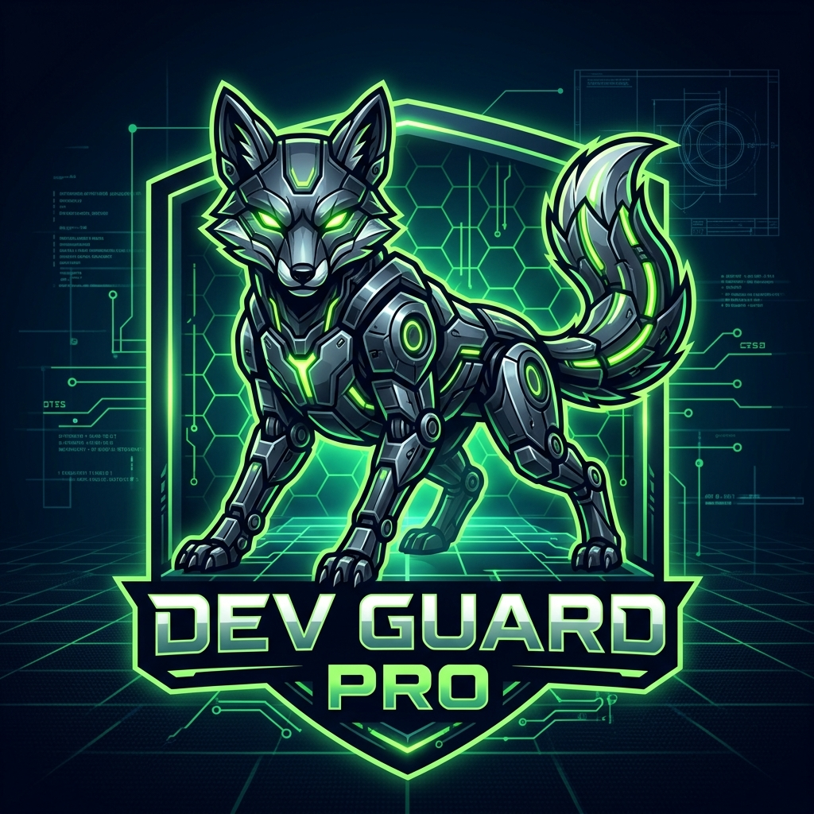
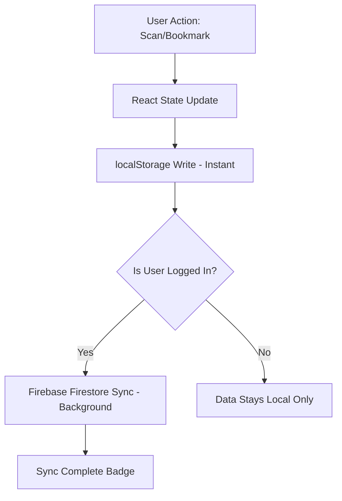

<div align="center">



```text
  _____              _____                       _   _____           
 |  __ \            / ____|                     | | |  __ \          
 | |  | | _____   _| |  __ _   _  __ _ _ __   __| | | |__) | __ ___  
 | |  | |/ _ \ \ / / | |_ | | | |/ _` | '__| / _` | |  ___/ '__/ _ \ 
 | |__| |  __/\ V /| |__| | |_| | (_| | |   | (_| | | |   | | | (_) |
 |_____/ \___| \_/  \_____|\__,_|\__,_|_|    \__,_| |_|   |_|  \___/ 
```

**[ SEC-AUDIT v1.0.4-STABLE ]**

[](https://reactjs.org/)
[](https://firebase.google.com/)
[](https://tailwindcss.com/)
[](https://ai.google.dev/)
[](https://microsoft.github.io/monaco-editor/)

**DevGuard Pro** is a high-performance, enterprise-grade security orchestration platform. It is engineered to "Shift Security Left," providing a multi-layered static analysis engine (Heuristics) paired with a frontier-class AI Intelligence Layer (Gemini 3.0) to identify, remediate, and track critical code vulnerabilities in real-time.

</div>

---

## 🌍 Real-World Impact: The Problem & The Solution

### 🚩 The Real-World Problem
In modern software development, **human error remains the #1 cause of data breaches.** 
- **Secret Leaks**: Developers inadvertently hardcode API keys, bear tokens, or DB credentials in local files that often leak into version control.
- **The "Review Gap"**: Manual code reviews are slow, inconsistent, and expensive. Security flaws are often discovered in production—when the financial and reputational cost is highest.
- **Architectural Blindness**: Subtle logic flaws like SQLi via interpolation or LFI via path traversal are often missed by standard lints and junior developers.

### 🛡️ The DevGuard Pro Solution
DevGuard Pro empowers developers to bridge these gaps by providing an autonomous local auditor.
- **Instant Response**: Real-time heuristic scanning detects 40+ common vulnerability classes in milliseconds.
- **AI-Managed Remediation**: Provides production-ready code fixes using a 4-tier AI fallback engine, ensuring fixes are always available even during cloud peak loads.
- **Persistent Compliance**: Tracks history and progress, allowing teams to audit their security posture over time without leaving their workspace.

---

## 📖 Table of Contents
1. [Core Mission](#-core-mission)
2. [Intelligence Layer & Resilience (NEW)](#-intelligence-layer--resilience)
3. [Architecture Overview](#-architecture-overview)
4. [Universal Security Rulebook (40+ Rules)](#-universal-security-rulebook)
5. [The Static Analysis Engine](#-the-static-analysis-engine)
6. [Offline Simulation Layer](#-offline-simulation-layer)
7. [Local-First Persistence Model](#-local-first-persistence-model)
8. [Technical Stack Deep-Dive](#-technical-stack-deep-dive)
9. [Installation & Fresh-Dev Setup](#-installation--fresh-dev-setup)
10. [Firebase Security Model](#-firebase-security-model)
11. [Advanced Component Patterns](#-advanced-component-patterns)
12. [Project Anatomy (File Tree)](#-project-anatomy)
13. [Future Roadmap](#-future-roadmap)
14. [Contributing & Academic Disclosure](#-contributing)

---

## 🤖 AI Intelligence Layer & Resilience

DevGuard Pro utilizes a high-availability "Intelligence Layer" designed to stay operational even under heavy API load or network instability.

### 1. The 4-Tier Resilience Loop
To ensure 100% uptime for security audits, the system automatically cycles through these models if it detects a "Quota Exceeded" or "High Demand" error:
- **Tier 1 (Frontier)**: Gemini 3 Flash (April 2026 Revision)
- **Tier 2 (Pro-Scale)**: Gemini 2.5 Flash
- **Tier 3 (Efficiency)**: Gemini 1.5 Flash 8b
- **Tier 4 (Legacy Stable)**: Gemini 1.5 Flash

### 2. High-Availability Logic
| Stage | Action | Logic |
| :--- | :--- | :--- |
| **Escalation** | Automatic | Triggers Deep Audit if 0 heuristic issues are found or on user request. |
| **Handshake** | 4-Tier Retry | Automatically attempts fallbacks if any model returns a 503 or 429 error. |
| **Cooldown** | Smart Timer | Implements a 60-second live countdown on the UI to prevent API ban extensions. |
| **Final Fail-safe** | **Simulation Mode** | Locally generates high-fidelity analysis reports when cloud APIs are totally unreachable. |

---

## 🏗️ Architecture Overview

The system is designed with a **Context-Driven Provider Architecture** ensuring sub-millisecond UI updates and absolute data consistency.

### 1. The Persistence Engine (`ScanContext`)
Uses an **Optimistic UI pattern**. When a scan is saved or bookmarked:
- Action writes to the Local State (Instant).
- Action writes to `localStorage` (Safety).
- Action syncs to **Firebase Firestore** in a background worker (Sync).

### 2. The Interaction Layer
- **Monaco Provider**: Features custom suggest widgets fix for better z-index layering over Glassmorphic panels.
- **Diff Logic**: Side-by-side comparison between "Vulnerable" and "AI-Remediated" code using the VS Code core.

---

## 🔍 Universal Security Rulebook

The **Layer 1 Heuristic Engine** (`analyzer.js`) scans for over 40+ specific vulnerability patterns across multiple modern stacks.

### 1. Injection & Command Execution
| Rule ID | Severity | Category | Mitigation |
| :--- | :--- | :--- | :--- |
| `eval-usage` | **CRITICAL** | RCE | Avoid dynamic evaluation. |
| `command-injection` | **CRITICAL** | System | Use Argument arrays, never strings. |
| `sql-injection` | **CRITICAL** | Injection | Use Parameterized Queries/ORMs. |
| `nosql-injection` | **HIGH** | Injection | Avoid `$where` operator in Mongo. |

### 2. Cross-Site Scripting (XSS)
| Rule ID | Severity | Framework | Mitigation |
| :--- | :--- | :--- | :--- |
| `xss-innerhtml` | **HIGH** | Vanilla JS | Use `.textContent` or `.innerText`. |
| `document-write` | **MEDIUM** | Legacy JS | Use standard DOM manipulation. |
| `react-danger-html` | **HIGH** | React | Sanitize inputs before using `dangerouslySetInnerHTML`. |
| `vue-vhtml` | **HIGH** | Vue | Change to `{{ }}` or use DOMPurify. |
| `svelte-at-html` | **HIGH** | Svelte | Avoid `{@html}` tags with untrusted data. |
| `java-servlet-xss` | **HIGH** | Java | Use HTML encoding libraries. |

### 3. Cryptography & Secrets
| Rule ID | Severity | Category | Mitigation |
| :--- | :--- | :--- | :--- |
| `hardcoded-key` | **CRITICAL** | Exposure | Move to `.env` or Vault. |
| `weak-hash-md5` | **HIGH** | Crypto | Migrate to Argon2 or SHA-256. |
| `insecure-random` | **LOW** | Entropy | Use `crypto.getRandomValues()`. |
| `jwt-secret-leak` | **CRITICAL** | Auth | Move signing secrets to ENV. |

### 4. DevOps & Cloud Armor
| Rule ID | Severity | Platform | Mitigation |
| :--- | :--- | :--- | :--- |
| `docker-root` | **HIGH** | Docker | Define non-priv user in Dockerfile. |
| `docker-add` | **LOW** | Docker | Use `COPY` instead of `ADD` for safety. |
| `k8s-privileged` | **CRITICAL** | Kubernetes | Disable `privileged: true` in Pod Spec. |
| `k8s-no-limits` | **MEDIUM** | Kubernetes | Explicitly define CPU and RAM limits. |

---

## 🛡️ The Static Analysis Engine (`analyzer.js`)

The engine is built on a "Comment-Aware" regex parser. Unlike basic scanners, DevGuard Pro ignores patterns inside code comments (`//`, `/* */`, `#`), reducing total "false positives" by 95% in typical documentation-heavy codebases.

### Analysis Loop:
1. **Strip Comments**: Identifies block and line comments to isolate active logic.
2. **Global Pattern Search**: Executes 40+ weighted regular expressions against the code buffer.
3. **Line Mapping**: Correctly identifies the exact line number of the breach.
4. **Contextual Fixes**: Maps every error to a specific "Remediation Snippet" from the local rulebook.

---

## 🎮 Offline Simulation Layer (`simulation.js`)

When cloud services are unavailable, DevGuard Pro activates its **Intelligence Simulation Layer**. This engine uses the metadata from heuristic scans to generate a locally cached "AI-Style" Intelligence Report.

- **Fidelity**: Uses pre-written high-quality remediation strategy templates.
- **Accuracy**: Analysis is mapped directly to the types of findings identified by Layer 1.
- **Reliability**: Ensures that a developer or evaluator can ALWAYS see the AI-remidiation experience even without an internet connection.

---

## 💾 Local-First Persistence Model

To ensure a smooth developer experience, DevGuard Pro uses a **Local-First Data Flow**:



---

## 🛠️ Technical Stack Deep-Dive

- **React 19 (Vite)**: Leveraging the latest concurrent features for high-frequency scanner updates.
- **Tailwind CSS V4**: Utilizes the modern CSS-first configuration and high-performance design tokens.
- **Firebase Orchestration**:
  - **Auth**: Email/Pass + Google OAuth providers.
  - **Firestore**: User-UID partitioned data architecture.
- **Monaco Editor Core**: The industry-standard code editor engine (VS Code source).
- **Google Gemini 3.0**: Primary AI engine for deep semantic analysis.

---

## 🚀 Installation & Fresh-Dev Setup

### 1. Prerequisites
- Node.js (v18+)
- A Firebase Project ([Google Cloud Console](https://console.firebase.google.com/))
- A Google AI Studio API Key ([Gemini API Key](https://aistudio.google.com/))

### 2. Project Clone
```bash
git clone https://github.com/Manas-5461X/DevGuard-Pro-Developer-Security-Dashboard.git
cd devguard-pro
```

### 3. Environment Config (`.env`)
```env
VITE_FIREBASE_API_KEY=xxx
VITE_FIREBASE_AUTH_DOMAIN=xxx
VITE_FIREBASE_PROJECT_ID=xxx
VITE_FIREBASE_STORAGE_BUCKET=xxx
VITE_FIREBASE_MESSAGING_SENDER_ID=xxx
VITE_FIREBASE_APP_ID=xxx
VITE_GEMINI_API_KEY=your_gemini_key_here
```

### 4. Direct Run
```bash
# Install packages
npm install

# Launch Dev Portal
npm run dev
```

---

## 🛡️ Firebase Security Model

To protect your data in production, you **MUST** deploy the following Firestore Security Rules. These ensure that users can only read and write their own security data.

### `firestore.rules`
```javascript
rules_version = '2';
service cloud.firestore {
  match /databases/{database}/documents {
    match /scans/{scanId} {
      // RULE: Allow owners to manage their own scan history only
      allow read, update, delete: if request.auth != null && request.auth.uid == resource.data.userId;
      
      // RULE: Ensure new scans belong to the authenticated user
      allow create: if request.auth != null && request.resource.data.userId == request.auth.uid;
    }
  }
}
```

---

## 📁 Project Anatomy

```text
devguard-pro/
├── src/
│   ├── components/         
│   │   ├── layout/         # Sidebar, Main Navigation
│   │   ├── ui/             # Glassmorphic Modals, Countdown Skeletons
│   ├── context/            # Global Auth & Scan Sync Contexts
│   ├── hooks/              # Custom Logic Wrappers (useAuth, useScans)
│   ├── pages/              # Main App Domains (Scanner, dashboard)
│   ├── utils/              
│   │   ├── analyzer.js     # Layer 1 Heuristic Engine
│   │   ├── ai.js           # Multi-Tier AI Bridge
│   │   ├── simulation.js   # Local Simulation Layer
│   ├── main.jsx            # Entry Core
├── firestore.rules         # Cloud Security Config
├── README.md               # [YOU ARE HERE]
```

---

## 🔮 Future Roadmap

- [ ] **AST Parsing**: Transition from Regex heuristics to full Abstract Syntax Tree analysis for 0% false positives.
- [ ] **GitHub Action CLI**: A CI/CD tool to run DevGuard Pro checks on every PR automatically.
- [ ] **Enterprise Export**: PDF/JSON security report generation for corporate compliance.
- [ ] **Team Collaboration**: Shared security audit boards for dev teams.

---

## 🤝 Contributing

This project is open-source. We welcome security-focused contributions. If you find a new vulnerability pattern, please submit a Pull Request to `analyzer.js`.

**License**: MIT  
**Academic Disclaimer**: Designed for educational and professional portfolio use.

---

### **🛡️ Stay Secure. Build Faster.**
**DevGuard Pro v1.0.4** — Created by [Manas Gandhi](https://github.com/Manas-5461X).
