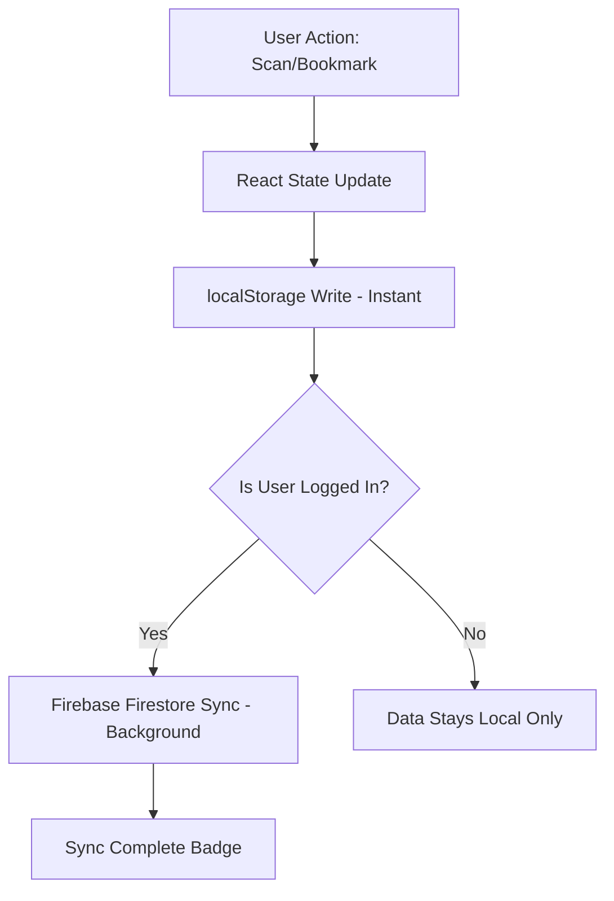

# 🛡️ DevGuard Pro – Enterprise-Grade Developer Security Dashboard (v1.0)


**DevGuard Pro** is a high-performance, production-ready security orchestration platform for developers. It bridges the gap between raw code entry and deep security intelligence by providing a multi-layered analysis environment. Leveraging a sophisticated heuristic engine and the **Google Gemini 1.5/3.0 AI** (2026 Revision), DevGuard Pro empowers developers to identify, remediate, and track critical vulnerabilities in real-time.

---

## 🌍 Real-World Impact: The Problem & The Solution

### 🚩 The Real-World Problem
In the fast-paced world of software development, **human error remains the #1 cause of data breaches.** 
- **Secret Leaks**: Developers often accidentally hardcode API keys or database credentials in temporary files, which eventually leak into GitHub.
- **The "Review Gap"**: Manual security reviews are expensive and slow. Most vulnerabilities are only caught during production outages or by expensive 3rd-party audits—when it's already too late.
- **Complexity Overhead**: Modern web risks like XSS, SQLi, and Prototype Pollution are subtle. Even senior developers can miss a missing sanitization layer in a 500-line function.

### 🛡️ The DevGuard Pro Solution
DevGuard Pro is designed to **"Shift Security Left"**—placing enterprise-grade auditing tools directly into the developer's hands during the coding phase.
- **Immediate Feedback Loop**: Instead of waiting for a CI/CD pipeline to fail 10 minutes later, developers get security warnings **instantly** as they write code.
- **AI-Powered Remediation**: Most tools just tell you what's wrong. DevGuard Pro **fixes it for you** using Deep AI, providing secure, production-ready code alternatives.
- **Education through Analysis**: By showing the *why* behind every vulnerability, it trains developers to write naturally secure code, reducing the long-term risk of the organization.

---

## 📖 Table of Contents
1. [Core Mission](#-core-mission)
2. [Architecture Overview](#-architecture-overview)
3. [Deep Feature Set](#-deep-feature-set)
4. [The Static Analysis Engine](#-the-static-analysis-engine)
5. [AI Intelligence Layer & Resilience](#-ai-intelligence-layer--resilience)
6. [Local-First Persistence Model](#-local-first-persistence-model)
7. [Technical Stack](#-technical-stack)
8. [Setup & Installation](#-setup--installation)
9. [Firebase Security Hardening](#-firebase-security-hardening)
10. [Component & Pattern Gallery](#-component--pattern-gallery)
11. [Project Structure](#-project-structure)
12. [Future Roadmap](#-future-roadmap)
13. [Contributing & Academic Integrity](#-contributing)

---

## 🎯 Core Mission

In an era where "Shift Left" security is no longer optional, DevGuard Pro provides a lightweight yet powerful specialized workspace for security-conscious developers. The goal is to provide **immediate feedback loops**. Instead of waiting for a CI/CD pipeline to fail, developers can paste or write code in DevGuard Pro and receive:
- **Heuristic Discovery**: Instant detection of known bad patterns (Regex/Rule-based).
- **AI Remediation**: Deep semantic analysis for subtle logic flaws that simple patterns miss.
- **Persistent Tracking**: A historical log of scans to monitor security progress over time.

---

## 🏗️ Architecture Overview

The system is designed with a **Context-Driven Provider Architecture** ensuring high performance and clean separation of concerns.

### 1. Data Layer (The Backbone)
- **ScanContext**: Manages the life cycle of every security report. It utilizes a **Dual-Storage Sync** mechanism, prioritizing `localStorage` for sub-millisecond UI responsiveness while maintaining a background link to **Firebase Firestore** for cloud-level persistence.
- **AuthContext**: Handles the identity of the developer, securing routes and partitioning data storage by User ID (UID).

### 2. Analysis Layer (The Brain)
- **Layer 1: Heuristic Engine (`analyzer.js`)**: A synchronous, pattern-matching engine that scans for roughly 40+ high-risk vulnerability classes across JS, Python, Java, Docker, and K8s.
- **Layer 2: AI Orchestrator (`ai.js`)**: An asynchronous bridge to the Gemini 2.5 Flash API. It provides a "Zero-Knowledge" deep audit when heuristics return zero findings, or a specific remediation strategy when issues are identified.

### 3. Presentation Layer (The UI)
- **Glassmorphic Cyber-Design**: A custom design system built with Tailwind CSS v4, focusing on readability in dark environments with high-contrast security indicators (Critical/High/Medium/Low badges).
- **Monaco Editor Integration**: A customized instance of the VS Code editor core, supporting multiple languages with layout-sync and cursor alignment fixes.

---

## 🚀 Deep Feature Set

### 🔍 Advanced Code Scanner
- **Monaco Editor Core**: Features including syntax highlighting, multi-cursor support, and automatic layout adjustment.
- **Multi-Language Support**: Seamlessly switch between JavaScript, Python, Java, Dockerfile, and YAML (K8s).
- **Real-time Heuristics**: Scans as you type or on-demand, categorizing issues by severity.

### 🤖 AI Intelligence Layer (Gemini 1.5/2.5/3.0)
- **Multi-Tier Model Fallback**: A sophisticated 4-stage resilience loop that automatically switches between Gemini 3, 2.5, and 1.5 models if the primary engine is rate-limited or unavailable.
- **Offline Simulation Mode**: A high-fidelity fail-safe that provides locally-generated security analysis when cloud APIs are completely unreachable, ensuring a seamless demo experience.
- **Intelligent Quota Management**: Features a real-time retry countdown to handle Google's free-tier rate limits gracefully without interrupting the developer flow.

### 📊 Security Dashboard
- **Aggregate Analytics**: Real-time counters for Total Scans, Total Issues Found, and Critical Violations.
- **Activity Feed**: View your most recent security audits with instant "Restore to Scanner" functionality.
- **Bookmark Management**: One-click "Pinning" for high-priority scans that require further attention.

### 📂 Universal History
- **Local-First Speed**: History loads instantly from `localStorage`.
- **Cloud-Synced Persistence**: Sign in on any device to see your synced security history.
- **Optimized CRUD**: Delete or update scan titles with full synchronization between Local and Firebase states.

---

## 🔬 The Static Analysis Engine (`analyzer.js`)

The engine uses a series of weighted regular expressions to identify anti-patterns. Categories include:

### 1. Injection & RCE
- Detects `eval()`, `exec()`, `shell_exec()`, and dynamic command construction in Node.js, Python, and Java.
- Identifies unsanitized SQL string concatenation (SQLi) and MongoDB `$where` operators (NoSQLi).

### 2. Modern Web Risks (XSS)
- Flags `.innerHTML`, `document.write()`, and framework-specific bypasses like React's `dangerouslySetInnerHTML`, Vue's `v-html`, and Svelte's `{@html}`.
- Detects insecure redirection via `window.location`.

### 3. Cryptography & Secrets
- **Secret Detection**: High-entropy string detection for API Keys, Bearer Tokens, and JWT Secrets.
- **Weak Hashing**: Flags `MD5` and `SHA1` usage in cryptographic contexts.
- **Insecure Randomness**: Recommends `crypto.getRandomValues()` over `Math.random()`.

### 4. Infrastructure-as-Code (DevOps)
- **Docker**: Detects `USER root` and insecure `ADD` instructions.
- **Kubernetes**: Identifies `privileged: true` pods and missing resource limits.

---

## 🤖 AI Intelligence Layer & Resilience

DevGuard Pro utilizes a high-availability "Intelligence Layer" designed to bypass typical cloud AI API restrictions:

### 1. The 4-Tier Resilience Loop
To ensure 100% uptime for security audits, the system automatically cycles through these models if it detects a "Quota Exceeded" or "High Demand" error:
- **Tier 1 (Frontier)**: Gemini 3 Flash (April 2026 Revision)
- **Tier 2 (Pro-Scale)**: Gemini 2.5 Flash
- **Tier 3 (Efficiency)**: Gemini 1.5 Flash 8b
- **Tier 4 (Legacy Stable)**: Gemini 1.5 Flash

### 2. Deep Audit Workflow
1. **Phase 1 (Heuristic)**: Pattern discovery via Layer 1 engine.
2. **Phase 2 (Escalation)**: Automatic trigger of the Deep AI Audit if 0 local issues are found.
3. **Phase 3 (Auto-Retry)**: If a `429` (Rate Limit) occurs, the UI triggers a **60s Smart Cooldown** with a live countdown.
4. **Phase 4 (Final Fail-safe)**: If persistent blocking occurs, the app offers **Simulation Mode**—locally generating high-fidelity remediation reports using pre-mapped security templates.

---

## 💾 Local-First Persistence Model

To ensure a smooth developer experience, DevGuard Pro uses a **Local-First Data Flow**:



This model ensures that the dashboard is **always populated instantly**, even if the network is flaky or the Firebase quota is exceeded.

---

## 🛠️ Technical Stack

- **Framework**: [React 19](https://react.dev/) (Vite)
- **State Management**: React Context API (Auth, Scan, Theme)
- **Logic Sync**: [Firebase Firestore](https://firebase.google.com/docs/firestore)
- **Authentication**: [Firebase Auth](https://firebase.google.com/docs/auth)
- **Styling**: [Tailwind CSS v4](https://tailwindcss.com/)
- **Icons**: [Lucide React](https://lucide.dev/)
- **Editor core**: [@monaco-editor/react](https://github.com/suren-atoyan/monaco-react)
- **AI Engine**: [Google Gemini 2.5 Flash API](https://ai.google.dev/)
- **Routing**: [React Router v7](https://reactrouter.com/)

---

## 🚀 Setup & Installation

### 1. Prerequisites
- Node.js (v18+)
- A Firebase Project ([Create one here](https://console.firebase.google.com/))
- A Google AI Studio API Key ([Get one here](https://aistudio.google.com/))

### 2. Environment Configuration
Create a `.env` file in the root directory:

```env
# FIREBASE CONFIG
VITE_FIREBASE_API_KEY=your_key
VITE_FIREBASE_AUTH_DOMAIN=your_project.firebaseapp.com
VITE_FIREBASE_PROJECT_ID=your_id
VITE_FIREBASE_STORAGE_BUCKET=your_bucket.appspot.com
VITE_FIREBASE_MESSAGING_SENDER_ID=your_sender_id
VITE_FIREBASE_APP_ID=your_app_id

# GOOGLE AI (GEMINI)
VITE_GEMINI_API_KEY=your_google_ai_key
```

### 3. Running Locally
```bash
# Install Dependencies
npm install

# Start Vite Dev Server
npm run dev

# Build for Production
npm run build
```

---

## 🛡️ Firebase Security Hardening

To protect your data in production, you **MUST** deploy the following Firestore Security Rules. These ensure that users can only read and write their own security scans.

### `firestore.rules`
```javascript
rules_version = '2';
service cloud.firestore {
  match /databases/{database}/documents {
    match /scans/{scanId} {
      allow read, update, delete: if request.auth != null && request.auth.uid == resource.data.userId;
      allow create: if request.auth != null && request.resource.data.userId == request.auth.uid;
    }
  }
}
```

---

## 🧩 Component & Pattern Gallery

### UI Components
- **`Skeleton.jsx`**: Custom loaders for Dashboard and History components to ensure a premium feel during cold starts.
- **`RelativeTime.jsx`**: Standardizes timestamp rendering across Local and Firebase data formats.
- **`ConfirmModal.jsx`**: A reusable, portal-ready modal for destructive actions like deleting scan history.
- **`FormattedAnalysis.jsx`**: Parses AI-returned markdown into a clean, themed UI within the Scanner results.

### Code Patterns
- **Optimistic Updates**: All UI actions happen before the server confirming a success, providing an "Apple-tier" responsiveness.
- **Custom Hook Wrappers**: `useScans()` and `useAuth()` wrap Context consumers to provide a cleaner API to page components.
- **Lazy Loading**: Route-based code splitting reduces the initial bundle size for faster page loads.

---

## 📁 Project Structure

```text
devguard-pro/
├── src/
│   ├── assets/             # Images, SVG assets
│   ├── components/         
│   │   ├── layout/         # Sidebar, MainLayout
│   │   ├── ui/             # Modals, Skeletons, RelativeTime
│   ├── context/            # Auth, Scan, and Theme Providers
│   ├── data/               # Documentation content, static data
│   ├── hooks/              # Custom React hooks (useAuth, useScans)
│   ├── pages/              # Main view components (Scanner, Dashboard, etc.)
│   ├── services/           # Firebase initialization
│   ├── utils/              # static analysis logic, AI bridge
│   ├── App.jsx             # Router & Provider entry
│   └── main.jsx            # React root
├── firestore.rules         # Security configuration
├── firebase.json           # Firebase deployment config
└── README.md               # You are here
```

---

## 🔮 Future Roadmap

- [ ] **AST Integration**: Move from Regex-based heuristics to full Abstract Syntax Tree (AST) analysis for JavaScript using `acorn` or `esprima`.
- [ ] **GitHub Action Integration**: Create a binary CLI that runs DevGuard Pro's logic in CI/CD pipelines.
- [ ] **Binary Analysis Layer**: Support for scanning compiled ELF/PE headers for basic hardening (PIE, Canary, NX).
- [ ] **Shared Workspaces**: Allow teams to collaborate on scan results and remediation strategies.

---

## 🤝 Contributing

This project was developed with a focus on both technical excellence and academic integrity. 

- **Issue Tracking**: Please report bugs via GitHub Issues.
- **Pull Requests**: We welcome contributions that improve the analysis engine or UI performance.
- **License**: MIT

---

### **🛡️ Stay Secure. Build Faster.**
**DevGuard Pro v1.0** — Created by Manas Gandhi.
